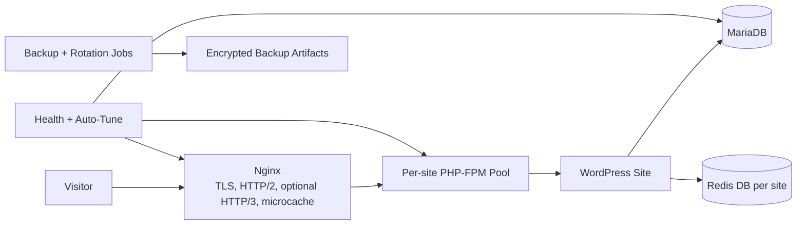

# DazeStack WP

<p align="center">
  <strong>Laze while your WordPress stack builds itself.</strong>
</p>

<p align="center">
  
  
  
  
  
</p>

<p align="center">
  DazeStack WP is part of the DazeStack series: automation-first tooling for production-grade WordPress operations.
</p>

<p align="center">
  
</p>

```text
+--------------------------------------------------------------------------------+
|                                DAZESTACK WP                                    |
|                One command to provision and manage WordPress LEMP             |
|          Per-site isolation | Caching | SSL | Backups | Diagnostics           |
+--------------------------------------------------------------------------------+
```

## Navigation

<p align="center">
  <a href="#why-dazestack-wp">Why</a> •
  <a href="#what-dazestack-wp-aims-to-deliver">Aims</a> •
  <a href="#feature-highlights-stacked-view">Features</a> •
  <a href="#performance-and-caching">Performance</a> •
  <a href="#security-model">Security</a> •
  <a href="#modern-and-optional-optimizations">Optimizations</a> •
  <a href="#quick-start">Quick Start</a> •
  <a href="#command-reference-with-explanations">Commands</a> •
  <a href="#cloud-and-provider-readiness">Cloud</a>
</p>

| Product | Product | Product |
|---|---|---|
| [Why DazeStack WP](#why-dazestack-wp) | [What DazeStack WP Aims to Deliver](#what-dazestack-wp-aims-to-deliver) | [Feature Highlights](#feature-highlights-stacked-view) |
| [Performance and Caching](#performance-and-caching) | [Security Model](#security-model) | [Modern and Optional Optimizations](#modern-and-optional-optimizations) |
| [What Gets Installed](#what-gets-installed-in-simple-words) | [System Requirements](#system-requirements) | [Cloud and Provider Readiness](#cloud-and-provider-readiness) |
| [Quick Start](#quick-start) | [CLI Usage](#cli-usage) | [Command Reference](#command-reference-with-explanations) |
| [Architecture Snapshot](#architecture-snapshot) | [Important Paths](#important-paths) | [Documentation](#documentation) |
| [Interactive Menu](#interactive-menu-experience) | [Module Sections](#module-sections-from-the-codebase) | [Automation-Friendly](#automation-friendly) |
| [Licensing](#licensing-open-core) | [Trademark](#trademark) | [Support and Contact](#support-and-contact) |

## Why DazeStack WP

WordPress setup looks simple until production expectations appear: isolation, caching, SSL, backups, tuning, diagnostics, and repeatable operations.

DazeStack WP reduces manual work by giving you a practical automation baseline for Ubuntu 24.04+.

- `✅` Provision full WordPress LEMP stacks quickly
- `✅` Isolate sites to reduce cross-site blast radius
- `✅` Use production-minded defaults from day one
- `✅` Operate with built-in diagnostics and maintenance commands

## DazeStack Philosophy

<p align="center">
  
</p>

> Build once. Repeat forever.
>
> Stop spending human effort on repetitive setup tasks.
> Use automation to produce reliable, secure, and consistent server outcomes.

DazeStack WP applies this philosophy to WordPress operations and acts as a foundation for future DazeStack modules and cloud workflows.

## What DazeStack WP Aims to Deliver

<table>
  <tr>
    <td>
      <strong>Speed</strong><br>
      Provision faster with a guided command-driven workflow.
    </td>
    <td>
      <strong>Consistency</strong><br>
      Build repeatable environments with predictable behavior.
    </td>
    <td>
      <strong>Safety</strong><br>
      Apply isolation, encryption, and operational hardening defaults.
    </td>
  </tr>
  <tr>
    <td>
      <strong>Observability</strong><br>
      Use health, cache, protocol, and compression diagnostics.
    </td>
    <td>
      <strong>Scalability</strong><br>
      Manage many sites with standardized operations.
    </td>
    <td>
      <strong>Cloud Readiness</strong><br>
      Prepare for template-based one-command server launches.
    </td>
  </tr>
</table>

## Who This Is For

- `🏢` Agencies managing multiple client WordPress sites
- `👨‍💻` Developers who want less setup toil and more build velocity
- `⚙️` DevOps teams standardizing WordPress delivery
- `☁️` Cloud users creating reproducible VPS/server templates
- `🧱` Hosting builders packaging managed WordPress offerings

## Feature Highlights (Stacked View)

<table>
  <tr>
    <td width="33%">
      <strong>Provisioning</strong><br><br>
      One-command install<br>
      Interactive menu + CLI mode<br>
      Phase runner architecture
    </td>
    <td width="33%">
      <strong>Isolation</strong><br><br>
      Per-site PHP-FPM pools<br>
      Per-site Redis DB allocation<br>
      Site-level service boundaries
    </td>
    <td width="33%">
      <strong>Performance</strong><br><br>
      Nginx source-build lifecycle<br>
      FastCGI microcache diagnostics<br>
      Brotli, Zstd, and gzip tuning
    </td>
  </tr>
  <tr>
    <td width="33%">
      <strong>Security</strong><br><br>
      Encrypted credentials<br>
      Encrypted backup workflow<br>
      UFW + fail2ban baseline
    </td>
    <td width="33%">
      <strong>Operations</strong><br><br>
      health-check and auto-tune<br>
      protocol-check and enforce<br>
      cache deep checks and reporting
    </td>
    <td width="33%">
      <strong>Extensibility</strong><br><br>
      upgrade-sites path<br>
      cloud/provider growth path<br>
      DazeStack ecosystem alignment
    </td>
  </tr>
</table>

## Performance and Caching

<p align="center">
  
  
  
  
</p>

DazeStack WP ships with multiple performance modules enabled and wired together out of the box.

### Out-of-the-Box Performance Stack

| Layer | What is configured |
|---|---|
| Nginx request path | FastCGI microcache zone, cache key strategy, cache lock, stale serving |
| Cache safety | Bypass maps for cookies, auth headers, request method, query args, cache-control/pragma |
| Object cache | Per-site Redis DB allocation (DB 1-15, DB 0 reserved) |
| Compression | gzip baseline + Brotli/Zstd when available, with profile optimizer |
| Runtime sizing | Auto-calculated worker/process sizing + pool rebalance commands |
| Network tuning | Sysctl performance profile with optional BBR where available |

```text
REQUEST -> NGINX -> [FASTCGI MICROCACHE]
                     | cache key: $scheme$host$request_uri
                     | lock + stale + optional background_update/revalidate
                     v
                 PHP-FPM (per-site pool) -> MariaDB
                     |
                     +-> Redis object cache (per-site DB)
RESPONSE <- compression pipeline (zstd -> brotli -> gzip)
```

### Performance and Cache Diagnostics

| Command | Purpose |
|---|---|
| `cache-status` | Per-site cache activity (HIT/MISS/BYPASS visibility) |
| `cache-deep-check` | Anonymous/query/cookie probe behavior validation |
| `cache-purge-check` | Source-build + purge module + loader wiring verification |
| `compression-status` | Active gzip/brotli/zstd status and levels |
| `compression-optimize` | Applies `auto`, `balanced`, `aggressive`, or `low-cpu` profile |
| `auto-tune` | Recalculates stack tuning from host resources |
| `rebalance-pools` | Re-sizes PHP-FPM pools for current site mix |

## Security Model

<p align="center">
  
</p>

Security baseline is applied through isolation, encryption, hardened defaults, and safer operational flows.

- Per-site PHP-FPM boundaries reduce cross-site impact
- Sensitive outputs use encrypted credential handling
- Database backups are encrypted before storage
- Nginx hardening and request control defaults are applied
- UFW + fail2ban baseline supports host-level defense
- Security disclosure and handling are documented in `SECURITY.md`

## Modern and Optional Optimizations

### Modern Protocol/Compression Features

<p align="center">
  
  
  
  
  
</p>

- HTTP/3 and QUIC (where build/runtime support exists)
- Brotli and Zstd (source-build support)
- HTTP/2 and protocol enforcement tooling

### Optional Enhancements

- CDN rewrite integration (`cdn-enable`, `cdn-disable`, `cdn-status`)
- Cloudflare real-IP sync (`update-cloudflare-ips`)
- AVIF/WebP generation (`optimize-images`)
- Scheduled Nginx source auto-update workflows

## What Gets Installed (In Simple Words)

DazeStack WP installs a complete WordPress hosting foundation, not just WordPress files. It wires your web server, runtime, database, cache, SSL, and maintenance tooling so the stack works as a single system from day one.

At the front, Nginx receives traffic, serves static files quickly, and handles TLS termination. Behind it, PHP-FPM executes WordPress code with per-site pool isolation, so one noisy site does not degrade every other site.

MariaDB stores all WordPress data (content, users, options, plugin/theme data), while Redis accelerates repeated object lookups to improve admin and frontend responsiveness. Certbot + Let's Encrypt manage HTTPS certificate issuance and renewal so secure transport stays automated.

Operationally, DazeStack WP adds diagnostics and lifecycle commands: health checks, tuning, protocol checks, cache checks, backup routines, and maintenance flows. The result is a production-style platform you can operate using one command interface.

```text
                DAZESTACK WP STACK INFOGRAPHIC

  [ Internet Visitors ]
           |
           v
  +---------------------+        TLS, HTTP/2, optional HTTP/3
  |        NGINX        |-------------------------------------+
  +---------------------+                                     |
           |                                                   |
           v                                                   |
  +---------------------+        per-site isolated workers     |
  |       PHP-FPM       |                                     |
  +---------------------+                                     |
      |                |                                      |
      v                v                                      |
+-------------+   +-------------+                             |
|   MariaDB   |   |    Redis    |  <--- object caching -------+
+-------------+   +-------------+
      |
      v
  +---------------------+
  |  WordPress Sites    |
  +---------------------+
           |
           v
  +---------------------+
  | Backups + Health +  |
  | Tune + Diagnostics  |
  +---------------------+
```

## System Requirements

All tiers require Ubuntu 24.04+ and root/sudo access.

| Tier | CPU | RAM | Disk | Best For |
|---|---|---|---|---|
| Minimal | 1 vCPU | 512MB to 1GB | 5GB+ | Learning, test installs, low traffic |
| Recommended | 2 vCPU | 2GB to 4GB | 10GB+ SSD | Most production small-to-medium sites |
| Best | 4+ vCPU | 8GB+ | 25GB+ SSD/NVMe | Multi-site hosting, heavier plugins, high traffic |

Network access is required for package installs, TLS certificate flows, and source-build workflows.

## Cloud and Provider Readiness

DazeStack WP is designed for VPS/cloud launches and future copy-paste install recipes.

### Providers

- [UpCloud](https://signup.upcloud.com/?promo=47N5Q6)
- [Cloudways](https://www.cloudways.com/en/?id=37017)
- [WP Engine](https://www.wqwln8trk.com/35WQKDHRL/724Q1H9KF/?source_id=github&sub1=dazestackwp)
- [AWS EC2](https://aws.amazon.com/ec2/)
- [DigitalOcean](https://www.digitalocean.com/)
- [Hetzner Cloud](https://www.hetzner.com/cloud)
- [Hostinger](https://www.hostinger.com/)
- [Kamatera](https://www.kamatera.com/)
- [IONOS](https://www.ionos.com/)

<table>
  <tr>
    <td align="center">
      <a href="https://signup.upcloud.com/?promo=47N5Q6"><br>UpCloud</a>
    </td>
    <td align="center">
      <a href="https://www.cloudways.com/en/?id=37017"><br>Cloudways</a>
    </td>
    <td align="center">
      <a href="https://www.wqwln8trk.com/35WQKDHRL/724Q1H9KF/?source_id=github&sub1=dazestackwp"><br>WP Engine</a>
    </td>
  </tr>
  <tr>
    <td align="center">
      <a href="https://aws.amazon.com/ec2/"><br>AWS EC2</a>
    </td>
    <td align="center">
      <a href="https://www.digitalocean.com/"><br>DigitalOcean</a>
    </td>
    <td align="center">
      <a href="https://www.hetzner.com/cloud"><br>Hetzner</a>
    </td>
  </tr>
  <tr>
    <td align="center">
      <a href="https://www.hostinger.com/"><br>Hostinger</a>
    </td>
    <td align="center">
      <a href="https://www.kamatera.com/"><br>Kamatera</a>
    </td>
    <td align="center">
      <a href="https://www.ionos.com/"><br>IONOS</a>
    </td>
  </tr>
</table>

### Planned Copy-Paste Launch Recipes

- `1-click user-data` snippet per provider
- Pre-install + first-site bootstrap scripts
- Optional CLI wrapper auto-install in provisioning flow

## Quick Start

### Fast Path

```bash
chmod +x dazestack-wp.sh
sudo bash dazestack-wp.sh
```

### Interactive Setup Flow

1. Install base stack with the command above.
2. Create your first site.
3. Point DNS to server IP.
4. Enable SSL once DNS is live.
5. Run health checks.
6. Enable CLI wrapper for easier daily commands.

```bash
sudo bash dazestack-wp.sh create-site example.com admin@example.com
sudo bash dazestack-wp.sh enable-ssl example.com
sudo bash dazestack-wp.sh health-check
sudo bash dazestack-wp.sh install-cli
```

<details>
  <summary><strong>Quick Start Option A: Run directly from GitHub</strong></summary>

```bash
curl -fsSL https://raw.githubusercontent.com/DazeStack/DazeStackWP/main/dazestack-wp.sh -o dazestack-wp.sh
chmod +x dazestack-wp.sh
sudo bash dazestack-wp.sh
```
</details>

<details>
  <summary><strong>Quick Start Option B: Cloud-init/user-data style bootstrap</strong></summary>

```bash
#!/usr/bin/env bash
set -euo pipefail
curl -fsSL https://raw.githubusercontent.com/DazeStack/DazeStackWP/main/dazestack-wp.sh -o /root/dazestack-wp.sh
chmod +x /root/dazestack-wp.sh
bash /root/dazestack-wp.sh
```
</details>

## CLI Usage

Common daily commands:

```bash
dazestack-wp list-sites
dazestack-wp create-site example.com admin@example.com
dazestack-wp health-check
dazestack-wp auto-tune
dazestack-wp help
```

## Automation-Friendly

DazeStack WP is suitable for:

- CI/CD bootstrap steps
- cloud-init and user-data workflows
- repeatable VPS provisioning scripts
- standardized team runbooks

## Command Reference (With Explanations)

### Core Lifecycle

| Command | What it does | Example |
|---|---|---|
| `dazestack-wp` | Runs main installer flow (menu on TTY). | `sudo bash dazestack-wp.sh` |
| `menu` | Opens interactive menu mode. | `sudo bash dazestack-wp.sh menu` |
| `health-check` | Runs full diagnostics across stack components. | `sudo bash dazestack-wp.sh health-check` |
| `auto-tune` | Recalculates and applies tuning presets. | `sudo bash dazestack-wp.sh auto-tune` |
| `rebalance-pools` | Recomputes PHP-FPM pool sizing for existing sites. | `sudo bash dazestack-wp.sh rebalance-pools` |
| `list-sites` | Lists all managed sites in registry. | `sudo bash dazestack-wp.sh list-sites` |

### Site Management

| Command | What it does | Example |
|---|---|---|
| `create-site` | Creates a new WordPress site, DB, pool, and core wiring. | `sudo bash dazestack-wp.sh create-site example.com admin@example.com` |
| `show-credentials` | Displays decrypted credentials for a site. | `sudo bash dazestack-wp.sh show-credentials example.com` |
| `enable-ssl` | Requests cert and enables secure vhost flow. | `sudo bash dazestack-wp.sh enable-ssl example.com` |
| `delete-site` | Removes site and related configuration (with confirmation). | `sudo bash dazestack-wp.sh delete-site example.com` |
| `upgrade-sites` | Applies new snippets/features to existing sites. | `sudo bash dazestack-wp.sh upgrade-sites` |

### Cache, Protocol, and Compression

| Command | What it does | Example |
|---|---|---|
| `cache-status` | Shows cache hit/miss/bypass status. | `sudo bash dazestack-wp.sh cache-status --all` |
| `cache-deep-check` | Performs deeper cache behavior probes. | `sudo bash dazestack-wp.sh cache-deep-check --all` |
| `cache-purge-check` | Verifies purge module build/wiring readiness. | `sudo bash dazestack-wp.sh cache-purge-check` |
| `protocol-check` | Deep protocol readiness check for HTTP/2 and HTTP/3 paths. | `sudo bash dazestack-wp.sh protocol-check --all` |
| `protocol-enforce` | Enforces protocol directives on SSL vhosts. | `sudo bash dazestack-wp.sh protocol-enforce --all` |
| `compression-status` | Reports gzip/brotli/zstd status. | `sudo bash dazestack-wp.sh compression-status` |
| `compression-optimize` | Applies compression preset profile. | `sudo bash dazestack-wp.sh compression-optimize auto` |

### Nginx Source Build and Edge Tooling

| Command | What it does | Example |
|---|---|---|
| `nginx-source-build` | Builds/pins Nginx from source with modern modules. | `sudo bash dazestack-wp.sh nginx-source-build stable --auto` |
| `rebuild-nginx` | Rebuilds Nginx from saved source build state. | `sudo bash dazestack-wp.sh rebuild-nginx` |
| `nginx-auto-update` | Manages scheduled source-line updates. | `sudo bash dazestack-wp.sh nginx-auto-update --status` |
| `enable-http3-all` | Patches SSL vhosts for HTTP/3 directives. | `sudo bash dazestack-wp.sh enable-http3-all` |

### CDN, Media, and Cloudflare

| Command | What it does | Example |
|---|---|---|
| `cdn-enable` | Enables CDN rewrite route for a site. | `sudo bash dazestack-wp.sh cdn-enable example.com https://cdn.example.com custom` |
| `cdn-disable` | Disables CDN rewrite route. | `sudo bash dazestack-wp.sh cdn-disable example.com` |
| `cdn-status` | Shows CDN status for site. | `sudo bash dazestack-wp.sh cdn-status example.com` |
| `update-cloudflare-ips` | Refreshes Cloudflare IP mappings. | `sudo bash dazestack-wp.sh update-cloudflare-ips` |
| `optimize-images` | Generates AVIF/WebP for images. | `sudo bash dazestack-wp.sh optimize-images --all` |

For full command list, run:

```bash
sudo bash dazestack-wp.sh help
```

## Backups and Maintenance

- Encrypted scheduled database backups
- Backup cleanup by age (`remove-old-backups`)
- Health and tuning maintenance commands
- Controlled reset/reinstall flows for lifecycle management

Always test restore procedures in staging.

## Architecture Snapshot



## Important Paths

- State and registries: `/var/lib/dazestack-wp/`
- Logs: `/var/log/dazestack-wp/`
- Backups: `/var/backups/dazestack-wp/`
- Credentials: `/root/.dazestack-wp/`
- Cloudflare recommendations: `/etc/dazestack-wp/cloudflare-recommended.txt`

## Documentation

- Quick Start: `QUICK-START-GUIDE.md`
- FAQ: `FAQ.md`
- Security: `SECURITY.md`
- Contributing: `CONTRIBUTING.md`
- Current Audit: `dazestack-wp-audit.md`
- Changelog: `CHANGELOG.md`
- License: `LICENSE`
- AGPLv3 Full Text: `LICENSES/AGPL-3.0.txt`
- Commercial Terms: `COMMERCIAL_LICENSE.md`
- Trademark Usage: `TRADEMARK.md`

## Interactive Menu Experience

`dazestack-wp.sh menu` launches a full interactive operations console with 24 actions.

```text
MENU GROUPS
- Installation & Site Ops: 1-7
- Performance & Tuning: 8-9, 14, 22-24
- Maintenance & Cleanup: 11-13, 15-16
- CDN/Cloud/Media: 10, 17-19
- Nginx Source Build (advanced): 21 (with nested submenu)
```

### Main Menu Highlights

| Menu Option | Action |
|---|---|
| `1` | Full installation |
| `2` | Create WordPress site |
| `6` | Enable SSL for site |
| `7` | Health check |
| `8` | Auto-tune performance |
| `9` | Rebalance PHP-FPM pools |
| `14` | Compression status |
| `18` | Flush Redis object cache (all sites) |
| `21` | Nginx source build submenu |
| `22` | Cache status report (HIT/MISS/BYPASS) |
| `23` | Deep cache diagnostics |
| `24` | Optimize compression profile |

### Advanced Nginx Submenu

- Build Nginx from source (with prompts for HTTP/3, Brotli, Zstd)
- Rebuild source-built Nginx
- Show build state
- Enforce HTTP/2 + HTTP/3 across SSL vhosts
- Manage Nginx auto-update schedule

## Module Sections (From the Codebase)

The installer is modular by design and split into core sections plus executable phases.

### Core Script Sections

| Section | Responsibility |
|---|---|
| `SECTION 1` | Core configuration/constants and defaults |
| `SECTION 2` | Security helper functions |
| `SECTION 3` | Input validation and sanitization |
| `SECTION 4` | Encryption and credential management |
| `SECTION 5` | Atomic locking for shared state safety |
| `SECTION 6` | Rollback and error recovery |
| `SECTION 7` | Registry/state functions (domains, Redis DB allocator) |
| `SECTION 8` | Resource calculator and adaptive sizing |
| `SECTION 9` | MySQL socket detection |
| `SECTION 10` | Pre-flight validation |
| `SECTION 11` | Installation phases (modular phase runner) |
| `SECTION 12` | Site management operations |
| `SECTION 13` | CLI entry point and command dispatch/menu flow |

### Installation Phases (`list-phases`)

`system-prerequisites` • `php` • `certbot` • `nginx` • `mariadb` • `redis` • `php-pools` • `registries` • `idempotency` • `microcache` • `cron` • `logrotate` • `backups` • `security` • `cleanup` • `health-check`

## Project Layout

```text
.
├── dazestack-wp.sh
├── README.md
├── QUICK-START-GUIDE.md
├── FAQ.md
├── SECURITY.md
├── CONTRIBUTING.md
├── CHANGELOG.md
├── LICENSE
├── LICENSES/
│   └── AGPL-3.0.txt
├── COMMERCIAL_LICENSE.md
└── TRADEMARK.md
```

## Licensing (Open-Core)

DazeStack WP uses a dual-license open-core model:

- Open Source: AGPLv3 (`LICENSE`)
- Canonical AGPL text: `LICENSES/AGPL-3.0.txt`
- Commercial License: available for proprietary/closed distribution and hosted-commercial terms (`COMMERCIAL_LICENSE.md`)

## Trademark

"DazeStack" and related branding assets are project trademarks.
Use of names/logos in derivatives or commercial offerings must follow `TRADEMARK.md`.

<p align="center">
  
  
</p>

## Contributing

Contributions are welcome across docs, performance tuning, quality, and operational hardening.
For workflow and validation expectations, see `CONTRIBUTING.md`.

## Support and Contact

- DazeStack: https://dazestack.com
- Founder: https://ashishdungdung.com
- Email: hello@dazestack.com

## Credits

<p align="center">
  
  
</p>

<p align="center">
  <strong>Built by <a href="https://ashishdungdung.com">Ashish Dungdung</a> under the <a href="https://dazestack.com">DazeStack</a> ecosystem.</strong><br>
  Ash Digital Services: <a href="https://ashishdungdung.com">ashishdungdung.com</a> | DazeStack: <a href="https://dazestack.com">dazestack.com</a><br>
  If this project saves you time, please star the repository and share feedback via issues/discussions.
</p>


